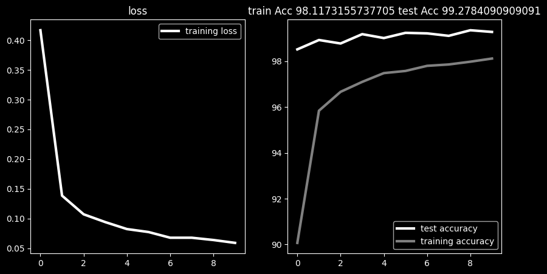
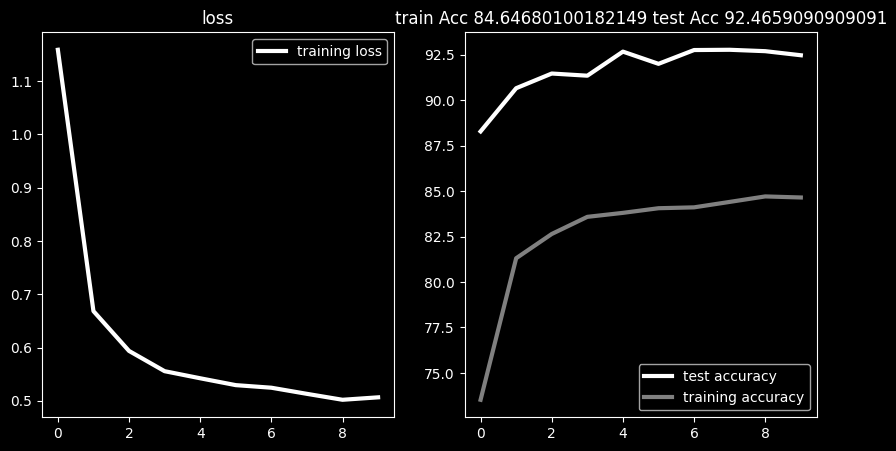
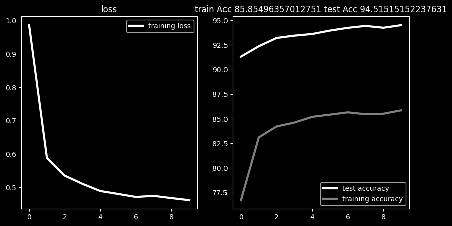

# Plant-Disease-Using-Custom-CNN-and-Transfer-Learning

## Overview
This project uses Convolutional Neural Networks (CNN) with Transfer Learning models to classify plant leaf diseases.
The goal is to help detect plant diseases early using deep learning, improving agricultural productivity and reducing crop loss. 

## What This Project Does
- Takes plant leaf images as input
- Uses CNN or  Pretrained models (EfficientNet / MobileNet / ResNet)
- Classifies disease type or healthy leaf
- Outputs prediction with confidence score

##  Models Used
- Custom CNN
- MobileNetV2 (Transfer Learning)
- EfficientNetB0 (Transfer Learning)
- ResNet18 (Transfer Learning)
Each model is trained and compared for accuracy and performance.

##  Results
| Model        |train|test| 
|--------------|-----------|
| Custom CNN   | 97.58|98.2|
| MobileNetV2  | 84.64|92.4|    
| EfficientNet | 85.84|94.5|
| ResNet18     | 98.11|99.2|                   

##  Training Graphs
Loss vs Epoch graph
1.Custom CNN


2.MobileNetV2


3.EfficientNet


4.ResNet18


##  Dataset

- Dataset: PlantVillage dataset
- Contains healthy and diseased plant leaf images
- Source: Kaggle

##  Tech Stack

- Python
- TensorFlow / PyTorch
- NumPy, Pandas
- Matplotlib, Seaborn
- Jupyter Notebook

#  How to Run

1. Clone the repository
```bash
git clone https://github.com/your-username/repo-name.git
Install dependencies
pip install -r requirements.txt
Run notebook or script
jupyter notebook

---

## 📂 Project Structure

Plant-Disease-Project/
│
├── notebooks/
│ ├── EfficientNet-B0.ipynb
│ ├── MobileNet-V2.ipynb
│
├── images/
│ ├── accuracy.png
│ ├── loss.png
│
├── Plant_disease_CNN.ipynb
├── README.md

## 💡 What I Learned

- CNN architecture and feature extraction
- Transfer learning with pretrained models
- Image preprocessing and augmentation
- Model evaluation and comparison